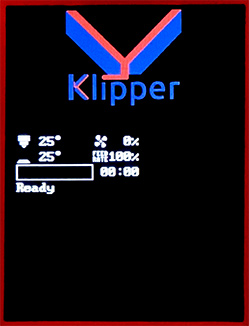
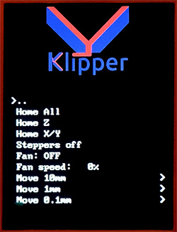

# Klipper for the Prusa Mini

### Unofficial Klipper fork for the Prusa Mini and Mini+

This is a fully working unofficial fork of Klipper for the Prusa Mini and Mini+,
adding full support for the ST7789V LCD, including the jogwheel.

There are many advantages to using Klipper:

* **Improved Print Quality**: Klipper offers improved print quality.
  * [Input Shaping](https://www.klipper3d.org/Resonance_Compensation.html)
    reduces ringing by canceling frame and belt resonances.
  * [Pressure Advance](https://www.klipper3d.org/Pressure_Advance.html)
    is similar to but improves upon Marlin's linear advance.
  * [Higher Precision Stepper Movement](https://www.klipper3d.org/Features.html).
* **Higher Speeds**: The gains in print quality allow for even higher printing
  speeds. I regularly run at 90mm/s with 3K accels on my Mini, and with
  structural improvements to the frame, higher speeds would easily be possible.
* **Skew Correction**: The Prusa Mini is inherently prone to skew, yet Prusa
  disabled Marlin's skew correction in their firmware. Klipper has built-in
  full 3-plane skew correction, which can easily be calibrated using
  [this simple STL and spreadsheet](https://github.com/matthewlloyd/Llama-Mini-Firmware#calibrating-skew).
* **Greater Configurability**: Prusa's firmware doesn't allow permanent
  modification of E-steps or PID values. These, and many other parameters,
  can be changed in Klipper simply by editing a config file and restarting
  the Klipper service on your Pi.
* **Better OctoPrint Support**: Klipper is designed from the outset to be
  used with a Raspberry Pi, and plays much better than Prusa's firmware
  with [OctoPrint](https://octoprint.org/). Klipper also has dedicated
  frontends including [Fluidd](https://github.com/cadriel/fluidd) and
  [Mainsail](https://github.com/meteyou/mainsail).

For a demo of the LCD, watch [this video](https://youtu.be/PKduopITGcU).




---

## Installing Klipper

For an easy to follow tutorial, see [KeenzKustoms' video](https://youtu.be/6KAFPcL1O-4).

### Jailbreak your Mini

You will need to cut out Prusa's appendix to install custom firmware.
Follow the instructions [here](https://help.prusa3d.com/en/article/flashing-custom-firmware-mini_14/).
This is irreversible and voids the warranty, although in the US
you are protected by the [Magnuson-Moss Warranty Act](https://www.ftc.gov/news-events/press-releases/2018/04/ftc-staff-warns-companies-it-illegal-condition-warranty-coverage).

Of course you could always buy a second Buddy board and let your Llama
run wild on that instead.

Alternatively, if you are good at very fine pitch soldering, you could
lift the BOOT0 pin off the board entirely and make your own jumpers
to connect it directly to 3.3V or GND as you need (the appendix merely
[shorts BOOT0 directly to GND](https://hackaday.com/2019/12/16/prusa-dares-you-to-break-their-latest-printer/)).

Once you have done that, you can install Klipper.

### Build and Flash Klipper

Follow the standard Klipper instructions [here](https://www.klipper3d.org/Installation.html).
Instead of:

```
git clone https://github.com/KevinOConnor/klipper
```

Use:

```
git clone https://github.com/keenzkustoms/klippermini
```

Then follow the instructions in `config/printer-prusa-mini-plus-2020.cfg`,
some of which are repeated here.

To use this config, the firmware should be compiled for the STM32F407. Run
"make menuconfig" and set the following parameters:

- check `Enable extra low-level configuration options`
- set `Microcontroller Architecture` to `STMicroelectronics STM32`
- set `Bootloader offset` to `128KiB + 512 byte offset`
- set `Clock Reference` to `12 MHz crystal`
- set `Communication interface` to `USB (on PA11/PA12)`

Connect the printer to your Raspberry Pi using the printer's micro-USB port.
If you prefer to remove Prusa's stock bootloader entirely, select the
"No bootloader" option.

When flashing for the first time, you will need to break the "appendix"
on the Buddy board, then put the device into DFU mode by moving the jumper
on the 3-pin header (older boards) or shorting the 2-pin header (newer boards)
and resetting, and finally use "make flash" to install Klipper. Once Klipper is
installed, you no longer need the jumper - just use "make flash" which will
automatically put the device into DFU mode.

Note that if you were previously running Prusa firmware, you must fully
power cycle the board after flashing. Otherwise, Klipper will be unable to
communicate with the TMC2209s due to the abrupt change in the baud rate,
and will show this error: "Unable to read tmc uart register IFCNT".

### Reinstalling Prusa's Firmware

Download Prusa's stock firmware [here](https://www.prusa3d.com/drivers/)
and follow Prusa's instructions to install it.

If you overwrote the bootloader, you can always reflash the board in DFU mode.
Compile the [original Prusa firmware](https://github.com/prusa3d/Prusa-Firmware-Buddy)
to output a DFU file:

```
$ python3 utils/build.py --generate-dfu --bootloader yes
```

If you built it from another machine, copy it to your Pi:

```
$ scp build/mini_release_boot/firmware.dfu <user>@<pi-host>:~/
```

Put your Buddy board in DFU mode by placing a jumper across the relevant pins
and resetting. If you have a 3-pin header next to the appendix (older versions
of the board), put the jumper between BOOT0 and 3.3V. If you have a 2-pin header,
just add a jumper.

Then flash from your Pi:

```
$ lsusb
Bus 001 Device 010: ID 0483:df11 STMicroelectronics STM Device in DFU Mode
$ sudo apt install dfu-util
$ dfu-util -a 0 -D firmware.dfu
```

Don't forget to remove the jumper before resetting.


---

## Original Klipper README

Welcome to the Klipper project!

[](https://www.klipper3d.org/)

https://www.klipper3d.org/

Klipper is a 3d-Printer firmware. It combines the power of a general
purpose computer with one or more micro-controllers. See the
[features document](https://www.klipper3d.org/Features.html) for more
information on why you should use Klipper.

To begin using Klipper start by
[installing](https://www.klipper3d.org/Installation.html) it.

Klipper is Free Software. See the [license](COPYING) or read the
[documentation](https://www.klipper3d.org/Overview.html). We depend on
the generous support from our
[sponsors](https://www.klipper3d.org/Sponsors.html).
